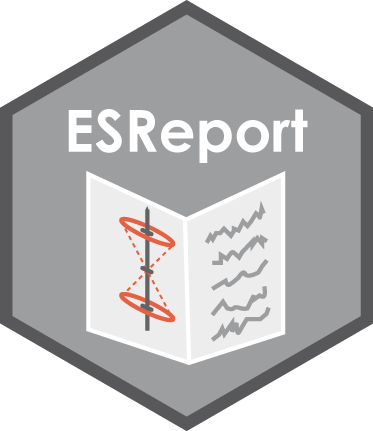

<!-- README.md is generated from README.Rmd. Please edit that file -->

# ESReport <a href='https://tzerk.github.io/ESReport/'></a>

<!-- badges: start -->

[](https://ci.appveyor.com/project/tzerk/esreport)
[](https://travis-ci.org/tzerk/ESReport)
<!-- badges: end -->

> [Find a full documentation of the package on the project
> page](https://tzerk.github.io/ESReport/)

## Overview

A Collection of Functions to Create Reports for Electron Spin Resonance
Dating Applications

## Installation

The ‘ESReport’ package is not available on the official CRAN servers.

However, the latest development builds can directly be installed from
GitHub. Simply run the following from an R console

``` r
if(!require("devtools"))
  install.packages("devtools")
devtools::install_github("tzerk/ESReport")
```

## Note

This version is a development version and it comes without any
guarentee\!

## License

The ESReport package is licensed under the GPLv3. See these files in the
main directory for additional details:

  - LICENSE - ESReport package license (GPLv3)
